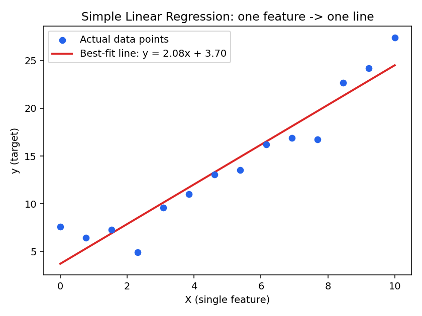

# Linear Regression & Multiple Linear Regression

## Simple Linear Regression

Models the relationship between **one** feature `x` and a target `y` as a straight line:

```
ŷ = m·x + b
```

- `m` (slope / coefficient) — how much `y` changes per unit increase in `x`.
- `b` (intercept) — the predicted `y` when `x = 0`.

Fitting the line means finding the `m` and `b` that minimize the total squared error between
predictions `ŷᵢ` and actual values `yᵢ` (ordinary least squares) — see
[`METRICS.md`](./METRICS.md#mean-squared-error-mse).



## Multiple Linear Regression

Same idea, extended to **several** features at once:

```
ŷ = w₁·x₁ + w₂·x₂ + ... + wₙ·xₙ + b
```

- Each feature `xᵢ` gets its own weight `wᵢ`, learned independently.
- `b` is still a single intercept shared across all predictions.
- Instead of fitting a line in 2D, this fits a flat **hyperplane** through an n-dimensional
  space (one dimension per feature, plus one for `y`) — same least-squares idea, just more
  dimensions.

---

## How This Project Does It

`index.ipynb` uses **multiple** linear regression: `price` is predicted from 5 features at once,
not just one.

**1. Choosing features and target** (`index.ipynb`, feature/target split):
```python
X = df[['area', 'bedrooms', 'bathrooms', 'stories', 'parking']]
y = df['price']
```
`X` is the feature matrix (5 columns), `y` is the target vector.

**2. Splitting into train/test sets:**
```python
X_train, X_test, y_train, y_test = train_test_split(X, y, test_size=0.2, random_state=42)
```
80% of rows are used to fit the model, 20% are held back to check it on data it hasn't seen.

**3. Fitting the model:**
```python
model = LinearRegression()
model.fit(X_train, y_train)
```
This solves for the 5 weights (`model.coef_`) and the intercept (`model.intercept_`) that best
fit `X_train`/`y_train`. So the learned equation looks like:

```
price = w_area·area + w_bedrooms·bedrooms + w_bathrooms·bathrooms
      + w_stories·stories + w_parking·parking + intercept
```

**4. Predicting on unseen data:**
```python
y_pred = model.predict(X_test)
```
Applies the learned weights/intercept to `X_test` to get predicted prices.

**5. Checking how good the fit is:**
```python
mean_absolute_error(y_test, y_pred)
mean_squared_error(y_test, y_pred)
r2_score(y_test, y_pred)
```
See [`METRICS.md`](./METRICS.md) for what each of these numbers means and how to read them.

See [`FUNCTIONS.md`](./FUNCTIONS.md) for a line-by-line reference of every function/method call
used above.
