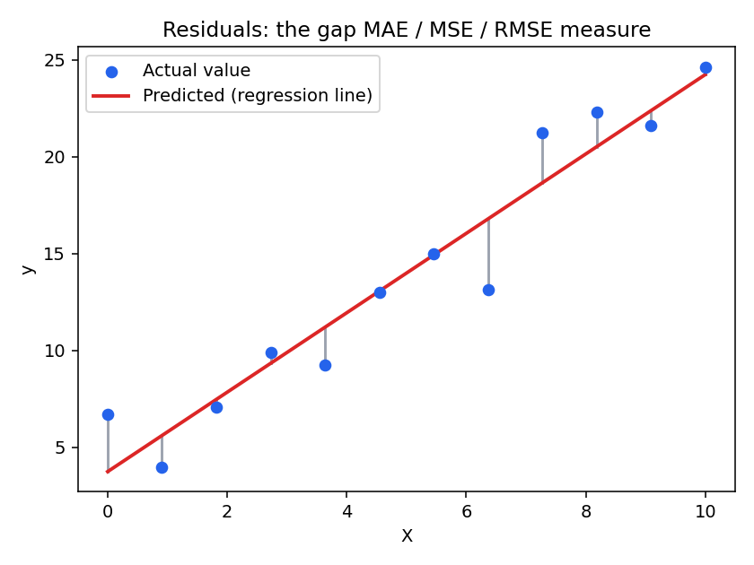
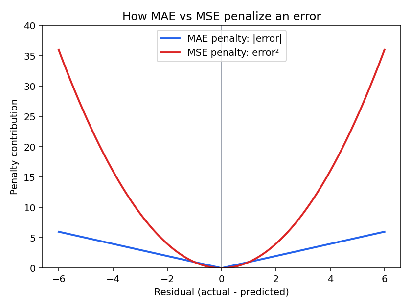
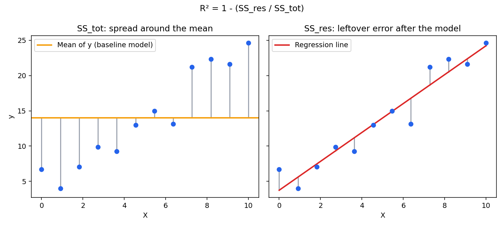

# Regression Error Metrics — Formulas & Visual Intuition

All formulas below use:
- `y_i` — actual value for sample *i*
- `ŷ_i` — predicted value for sample *i*
- `n` — number of samples
- `ȳ` — mean of all actual values

Every metric is built from the **residual**: `eᵢ = yᵢ − ŷᵢ`, the vertical gap between an actual
point and the regression line.



---

## Mean Absolute Error (MAE)

```
MAE = (1/n) * Σ |yᵢ − ŷᵢ|
```

Average of the *absolute* residuals. Every point's error contributes proportionally to its
size — a point that's off by 10 counts exactly twice as much as one off by 5. Same units as `y`,
easy to interpret directly (e.g. "on average we're off by ₹X").

## Mean Squared Error (MSE)

```
MSE = (1/n) * Σ (yᵢ − ŷᵢ)²
```

Average of the *squared* residuals. Squaring makes large errors count disproportionately more
than small ones — an error of 10 contributes 100, an error of 5 contributes only 25 (4x less,
not 2x). This makes MSE sensitive to outliers. Units are `y²`, which is why it's often converted
back via RMSE.



*Read this chart as: for the same-size mistake, MSE's parabola punishes it far harder than MAE's
straight line once the error grows.*

## Root Mean Squared Error (RMSE)

```
RMSE = √MSE = √( (1/n) * Σ (yᵢ − ŷᵢ)² )
```

Square root of MSE, bringing the units back to match `y`. Still penalizes large errors more
than MAE does, but is directly comparable to the target's scale.

## R² — Coefficient of Determination

```
R² = 1 − (SS_res / SS_tot)

SS_res = Σ (yᵢ − ŷᵢ)²        <- leftover error the model didn't explain
SS_tot = Σ (yᵢ − ȳ)²         <- total variance if you just guessed the mean every time
```

R² answers: *"How much better is this model than just predicting the average `y` for
everything?"*

- `R² = 1` → the model explains all the variance (perfect predictions).
- `R² = 0` → the model does no better than always predicting the mean.
- `R² < 0` → the model is worse than just predicting the mean.



*Left panel:* `SS_tot` — how spread out the actual values are around their mean (the orange
line), if you had no model at all.
*Right panel:* `SS_res` — how spread out the actual values are around the model's predictions
(the red regression line). The smaller these leftover gaps are relative to the left panel, the
closer R² gets to 1.

---

## Quick comparison

| Metric | Penalizes outliers | Units | Range | Good for |
|---|---|---|---|---|
| MAE | Linearly | same as `y` | `[0, ∞)` | Robust, easy-to-explain average error |
| MSE | Quadratically | `y²` | `[0, ∞)` | Optimization target (differentiable, punishes big misses) |
| RMSE | Quadratically | same as `y` | `[0, ∞)` | MSE's penalty behavior with interpretable units |
| R² | N/A (relative measure) | unitless | `(−∞, 1]` | "% of variance explained", comparing models |
