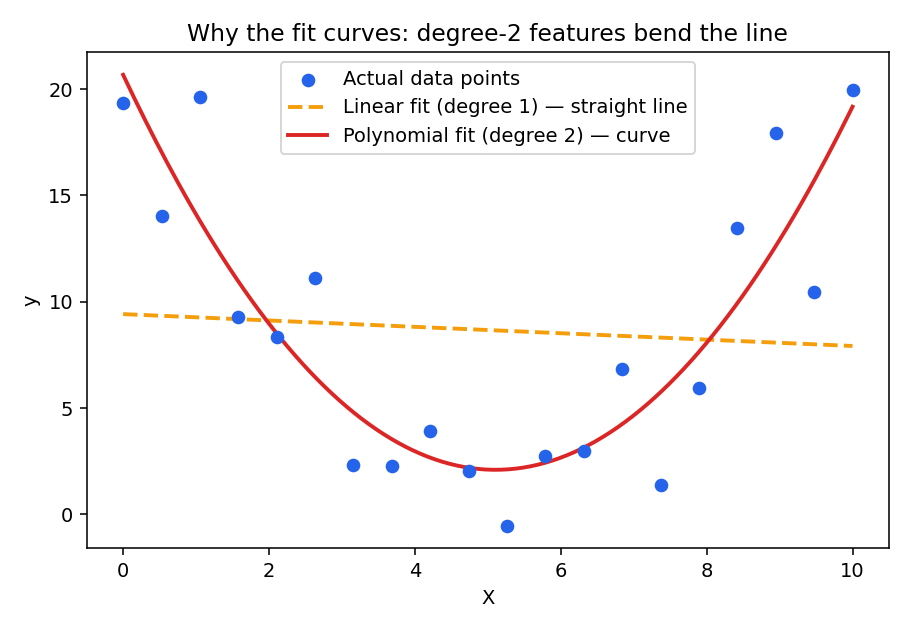

# Polynomial Regression

## What it is

Polynomial regression still fits a **linear model** — but on features that have been expanded
to include powers and interactions of the originals. For one feature `x` at degree 2:

```
ŷ = w₁·x + w₂·x² + b
```

For multiple features (`x₁, x₂, ...`) at degree 2, it also adds every pairwise **interaction**
term, not just squares:

```
ŷ = Σ wᵢ·xᵢ  +  Σ wᵢⱼ·(xᵢ·xⱼ)  +  Σ wᵢ·xᵢ²  +  b
```

The model itself is still `LinearRegression` — fit with ordinary least squares exactly like
before (see [`LINEAR_REGRESSION.md`](./LINEAR_REGRESSION.md)). What changes is the **input**:
instead of handing it `[x₁, x₂, ...]`, you hand it `[x₁, x₂, ..., x₁², x₂², ..., x₁x₂, x₁x₃, ...]`.
The line is straight in this expanded feature space, but curves when plotted back against the
original `x`.

## How the curve shape is formed

A straight line can only ever go up or down at a constant rate. Adding an `x²` term lets the
prediction accelerate/decelerate as `x` changes — that bend is what turns the fit into a curve
instead of a line.



*The dashed orange line is what plain linear regression is limited to. The red curve is what
becomes possible once `x²` (and interaction terms) are added as extra input columns — same
least-squares fitting method, richer inputs.*

---

## How This Project Does It

`linear-regression.ipynb` builds on the multiple linear regression setup from
[`LINEAR_REGRESSION.md`](./LINEAR_REGRESSION.md), but expands the features before fitting.

**1. Encoding categorical columns to numbers** (models only work on numbers):
```python
binary_cols = ['mainroad', 'guestroom', 'basement', 'prefarea', 'hotwaterheating', 'airconditioning']
df[binary_cols] = df[binary_cols].replace({'yes': 1, 'no': 0})
df['furnishingstatus'] = df['furnishingstatus'].replace(
    {'furnished': 2, 'semi-furnished': 1, 'unfurnished': 0}
)
```

**2. Expanding features to degree 2:**
```python
poly = PolynomialFeatures(degree=2, include_bias=False)
X = df[['area', 'bedrooms', 'bathrooms', 'stories', 'parking',
        'mainroad', 'guestroom', 'basement', 'prefarea',
        'hotwaterheating', 'airconditioning']]
X_poly = poly.fit_transform(X)
```
With 11 original columns, degree-2 expansion produces every original column, every square, and
every pairwise product — `X.shape` is `(rows, 11)` while `X_poly.shape` grows to
`(rows, 77)`. That's where the 77 comes from: 11 originals + 11 squared terms + C(11,2)=55
interaction terms = 77 total columns.

**3. Splitting, fitting, and predicting** — identical to plain multiple linear regression, just
using `X_poly` instead of `X`:
```python
X_train, X_test, y_train, y_test = train_test_split(X_poly, y, test_size=0.2, random_state=42)
model = LinearRegression()
model.fit(X_train, y_train)
y_pred = model.predict(X_test)
```

**4. Evaluating fit** (same metrics as before, see [`METRICS.md`](./METRICS.md)):
```python
mean_absolute_error(y_test, y_pred)
mean_squared_error(y_test, y_pred)
r2_score(y_test, y_pred)
model.score(X_train, y_train)   # R² on training data
model.score(X_test, y_test)     # R² on test data
```
Comparing train R² vs test R² here is a quick way to spot overfitting — if train R² is much
higher than test R², the expanded feature set is fitting noise in the training data rather than
a genuine pattern.

---

## Functions Used (new in this notebook)

### `sklearn.preprocessing.PolynomialFeatures(degree, include_bias)`
Constructs a transformer that expands input features into all polynomial combinations up to
`degree`. `include_bias=False` skips adding a constant `1` column (the model's own intercept
already covers that).

### `poly.fit_transform(X)`
Fits the transformer to `X` (learns how many features it has) and immediately applies the
expansion, returning the enlarged feature matrix (`X_poly`).

### `Series.replace(mapping)` / `DataFrame.replace(mapping)`
Replaces values matching the dict's keys with the dict's values. Used here to turn `'yes'/'no'`
and furnishing-status text into numbers the model can use.

### `model.score(X, y)`
Convenience method equivalent to computing `r2_score(y, model.predict(X))` — returns R² directly
for a given feature/target set, useful for quickly comparing train vs test performance.

See [`FUNCTIONS.md`](./FUNCTIONS.md) for the rest of the pipeline's functions (data loading,
train/test split, base `LinearRegression` usage).
