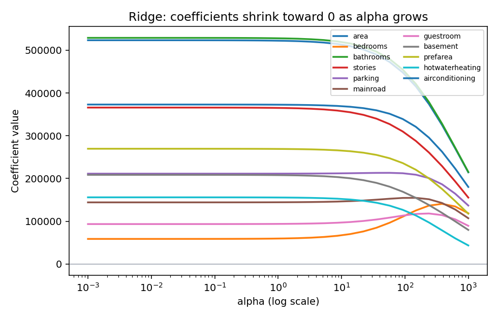
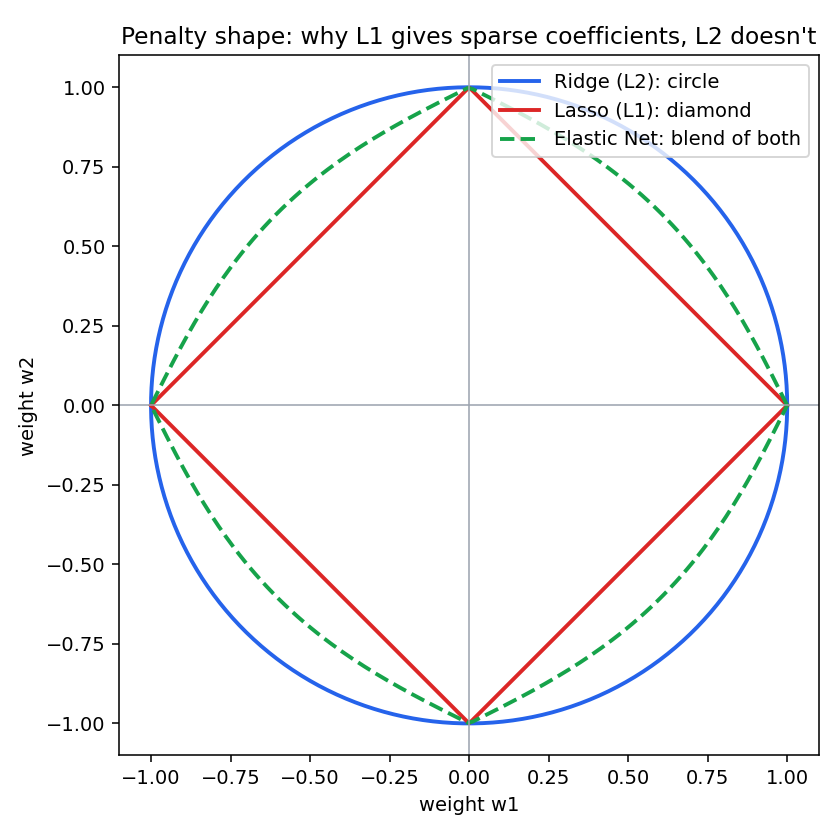

# Regularization: Ridge & Elastic Net

## Why regularize at all

Plain least-squares regression picks whatever coefficients minimize training error, with no
penalty for how large those coefficients get. With enough features — like the 77 columns
produced in [`POLYNOMIAL_REGRESSION.md`](./POLYNOMIAL_REGRESSION.md) — the model can start
fitting noise in the training set (overfitting): train R² climbs while test R² stalls or drops.

Regularization adds a penalty term for large coefficients directly into what the model
minimizes, trading a little training accuracy for a model that generalizes better.

```
Plain least squares:  minimize  Σ (yᵢ − ŷᵢ)²
Regularized:          minimize  Σ (yᵢ − ŷᵢ)²  +  penalty(weights)
```

## Ridge Regression (L2 penalty)

```
penalty = alpha * Σ wⱼ²
```

Ridge penalizes the **sum of squared weights**. Larger `alpha` → stronger penalty → weights get
pushed closer to zero, but essentially never *exactly* zero — every feature keeps some (shrunk)
influence.

- `alpha = 0` → identical to plain linear regression.
- `alpha → ∞` → all weights shrink toward 0 (model approaches predicting just the mean).



*Real coefficients from this project's housing features, refit at increasing `alpha`. Every line
drifts toward 0 as `alpha` grows — but none of them hit exactly 0.*

## Lasso (L1 penalty) — for context

```
penalty = alpha * Σ |wⱼ|
```

Not used directly in this project, but useful to know because Elastic Net combines it with
Ridge. Lasso's penalty can push some weights to **exactly** zero, effectively removing those
features — a form of automatic feature selection.

## Elastic Net (L1 + L2 combined)

```
penalty = alpha * [ l1_ratio * Σ |wⱼ|  +  (1 − l1_ratio) * Σ wⱼ² ]
```

Elastic Net blends both penalties using `l1_ratio` (between 0 and 1):

- `l1_ratio = 1` → pure Lasso (L1 only).
- `l1_ratio = 0` → pure Ridge (L2 only).
- in between → some coefficients can still be zeroed out (like Lasso), while correlated
  features get shrunk together rather than one being picked arbitrarily (like Ridge) — Lasso
  alone tends to pick one feature from a correlated group and zero the rest almost at random.

### Why the penalty *shape* matters



Each curve is the boundary of "how large the penalty allows weights to get" for a fixed budget.
The L1 diamond has sharp corners *on the axes* — when the true best-fit point (from the
unpenalized error) lands near an edge, the closest point on the diamond is often exactly at a
corner, i.e. one weight = 0. The L2 circle has no corners, so the closest point almost never
lands exactly on an axis — weights shrink but stay nonzero. Elastic Net's boundary sits between
the two, inheriting a bit of both behaviors depending on `l1_ratio`.

```python
from sklearn.linear_model import ElasticNet

model = ElasticNet(alpha=1.0, l1_ratio=0.5)
model.fit(X_train, y_train)
```

---

## How This Project Uses Ridge

All three notebooks scale features first with `StandardScaler` — required for Ridge/Elastic Net,
since the penalty term treats every weight equally, so features need to be on comparable scales
or the penalty unfairly punishes naturally large-valued features.

**`linear_regression_ridge.ipynb`** — Ridge on the 11 raw features:

```python
model = Ridge(alpha=1.0)
model.fit(X_train, y_train)
```

**`polynomial_regression_ridge.ipynb`** — Ridge on the 77 degree-2 expanded features, where
regularization matters much more (many more coefficients that can overfit):

```python
model = Ridge(alpha=2.0)
model.fit(X_train, y_train)
```

**`ridge_alpha_comparison.ipynb`** — sweeps `alpha` across several orders of magnitude to find
which one actually generalizes best, rather than guessing a single value:

```python
for alpha in [0.001, 0.01, 0.1, 1, 10, 100, 1000]:
    model = Ridge(alpha=alpha)
    model.fit(X_train, y_train)
    ...
```

Results are collected into a DataFrame and sorted by test R² — on this dataset, `alpha=100`
came out on top, meaning stronger regularization than the default `alpha=1.0` was actually
generalizing better on the 77-feature polynomial set.

See [`FUNCTIONS.md`](./FUNCTIONS.md) for the surrounding pipeline functions, and
[`METRICS.md`](./METRICS.md) for how MAE/MSE/RMSE/R² are computed and read.
